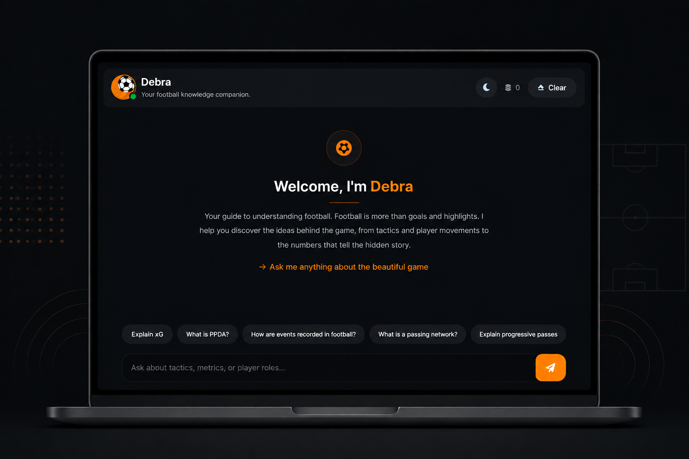
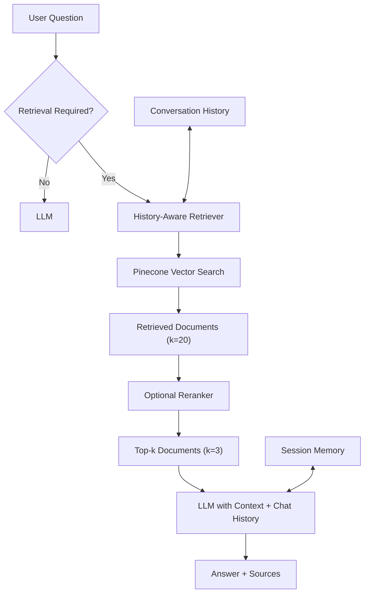

# Debra - Football Analytics RAG

A RAG-powered football analytics chatbot that lowers the barrier to entry into football analytics by teaching football concepts, terminology, match events, and data interpretation.

**Live Demo:** https://askdebra.vercel.app
**Alternative Deployment:** https://askdebra.onrender.com

---

## Overview

Debra bridges the gap between football knowledge and technical data skills by providing educational explanations of football analytics concepts and terminology.

It is designed for data analysts, performance analysts, scouts, coaches, students, and football enthusiasts.

Debra covers topics including Expected Goals (xG), Expected Assists (xA), pressing metrics, possession value, progressive actions, and other football analytics concepts.

---

## Key Features

| Feature                 | Description                                                                               |
| :----------------------- | :------------------------------------------------------------------------------------------ |
| RAG-based Retrieval     | Retrieves relevant knowledge from a curated football analytics PDF corpus using Pinecone. |
| Conversational Memory   | Maintains session context to support contextual follow-up questions.                      |
| History-Aware Retrieval | Reformulates questions using conversation history to improve retrieval relevance.         |
| Optional Reranking      | Uses a cross-encoder to rerank retrieved documents and improve context quality.           |
| Source Attribution      | Provides relevant source information, including document metadata and page numbers.       |
| Educational Responses   | Provides progressive explanations adapted to the user's level of understanding.           |

---

## Architecture

Debra uses a retrieval-augmented generation pipeline with conversational memory.

---

## How the RAG Pipeline Works

1. **Question Processing**
   The user submits a question through the chat interface.

2. **History-Aware Retrieval**
   For questions requiring knowledge retrieval, the system uses conversation history to reformulate the query.

3. **Vector Search**
   The reformulated query is used to retrieve the top `k=20` relevant documents from Pinecone.

4. **Optional Reranking**
   A cross-encoder can rerank the retrieved documents and select the top `k=3` results.

5. **Response Generation**
   The selected context, conversation history, and user question are provided to the LLM to generate the response.

6. **Source Attribution**
   Relevant source information is returned with the response.

---

## Tech Stack

| Component        | Technology                                                      |
| :---------------- | :----------------------------------------------------------------- |
| Runtime          | Python 3.10+                                                    |
| Web Framework    | Flask 3.1+                                                      |
| LLM Provider     | Groq                                                             |
| Language Models  | `llama-3.1-8b-instant`, `llama-3.3-70b-versatile`                |
| Vector Database  | Pinecone                                                         |
| Embeddings       | `multilingual-e5-large`                                          |
| Orchestration    | LangChain 0.3+                                                  |
| Reranker         | Sentence Transformers - `cross-encoder/ms-marco-MiniLM-L-2-v2`   |
| Frontend         | HTML5, CSS3, Bootstrap 4, JavaScript, jQuery, Marked.js          |
| Session Storage  | In-memory `ChatMessageHistory`                                   |
| Deployment       | Render with Gunicorn                                             |

---

## Deployment

Debra is deployed on Vercel, with an alternative deployment on Render.

**Live Demo:** https://askdebra.vercel.app
**Alternative Deployment:** https://askdebra.onrender.com

---

## Limitations and Design Considerations

- **Knowledge Base:** Responses are limited to the indexed PDF corpus and do not include live football or real-time match data.
- **Memory:** Conversation history is stored in memory and is lost when the server restarts.
- **Reranking:** The cross-encoder requires additional memory and can be disabled when necessary.
- **Model Dependency:** Response quality depends on the underlying LLM and embedding models.

---

## Future Improvements

- **Hybrid Search:** Combine vector search with keyword-based retrieval such as BM25.
- **Long-Term Memory:** Support conversation context across sessions.
- **User Feedback:** Collect feedback on generated responses.
- **Analytics Dashboard:** Monitor usage and retrieval patterns.
- **Multi-Modal Analysis:** Support visualisations such as shot maps, passing networks, and tactical diagrams.
- **Expanded Knowledge Base:** Add additional football data providers, leagues, and competitions.

---

## Author

**Oseko Ashpe (Ashpe Ayubu)**
Football Data Analyst

- GitHub: [@ashpe-osk](https://github.com/ashpe-osk)
- LinkedIn: [ashpe-ayubu](https://www.linkedin.com/in/ashpe-ayubu)
