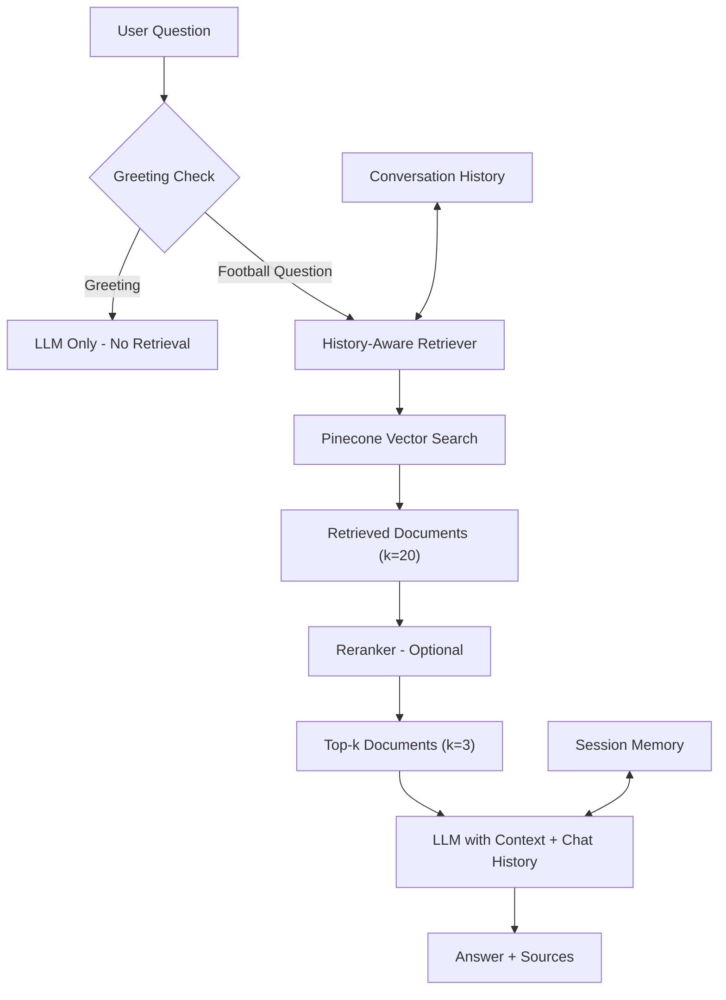

# Debra – Football Analytics RAG

Debra is an AI-powered football analytics mentor that explains football data concepts, terminology, and tactical ideas through a retrieval-augmented conversational interface.

**Live Demo:** [askdebra.onrender.com](https://askdebra.onrender.com/)

---

## Overview

Debra is an AI-powered football analytics mentor and learning assistant. It bridges the gap between technical data skills and football domain knowledge by delivering clear, educational explanations of football analytics concepts, terminology, tactical ideas, and event data definitions.

The system is designed for data analysts, performance analysts, scouts, coaches, students, and football enthusiasts who wish to understand the analytical aspects of the sport. Debra explains concepts such as Expected Goals (`xG`), Expected Assists (`xA`), pressing metrics, possession value, and progressive actions, and contextualises these within match situations, tactical frameworks, and data-driven decision-making processes.

---

## Core Capabilities

| Capability | Description |
|---|---|
| Conversational Memory | Maintains session context to handle follow-up questions (e.g., "How is it calculated?" after an xG explanation). |
| RAG-based Retrieval | Retrieves relevant knowledge from a curated PDF corpus stored in a Pinecone vector database. |
| History-Aware Retrieval | Rephrases user questions using conversation history to improve retrieval accuracy. |
| Reranking (Optional) | Applies cross-encoder reranking to refine retrieved results; can be disabled for low-memory deployments. |
| Source Attribution | Displays clean, deduplicated sources with page numbers and metadata via a collapsible interface. |
| Greeting and Small Talk Detection | Skips retrieval for casual interactions (e.g., "Hi", "Who made you?") to reduce token usage and improve responsiveness. |
| Ignorance Suppression | Hides source attribution when the system indicates it does not know the answer. |
| Identity and Creator Credit | Responds to identity-related questions with creator information and a GitHub link. |
| Nickname Flexibility | Accepts variations of the assistant's name (e.g., "Debby", "Debs") without correction, provided they are not abusive. |
| Educational Mentorship | Adapts explanations to user experience level (beginner, intermediate, advanced). |
| Rate Limit and Error Handling | Provides user-friendly error messages for API rate limits and connectivity issues. |
| Session Management | Preserves conversation context using Flask session handling. |

---

## RAG Architecture

The system implements a retrieval-augmented generation pipeline with conversational memory.

---

## How the RAG Pipeline Works

1. **Question reception** – The user submits a question through the Flask web interface.
2. **Greeting and small-talk detection** – Casual interactions are identified and routed directly to the LLM, bypassing retrieval to save tokens and reduce latency.
3. **History-aware query reformulation** – For substantive questions, the query is rephrased using prior conversation history to improve retrieval relevance.
4. **Pinecone retrieval** – The reformulated query is embedded and matched against a Pinecone vector database, returning an initial set of `k=20` candidate documents.
5. **Optional cross-encoder reranking** – When enabled, a cross-encoder reranker reorders the candidates by relevance, narrowing the result set to the top `k=3` documents. This step can be disabled for low-memory deployments.
6. **Context construction** – The selected documents are combined with the ongoing chat history to form the generation context.
7. **LLM generation** – The language model produces a response grounded in the retrieved context and conversation history.
8. **Source attribution** – Deduplicated source references, including page numbers and metadata, are displayed alongside the answer through a collapsible interface. Sources are withheld when the system indicates it does not know the answer.

---

## Technology Stack

| Component | Technology |
|---|---|
| Backend Framework | Flask |
| Orchestration | LangChain |
| Vector Database | Pinecone |
| Language Model | Groq |
| Deployment | Render |
| Runtime | Python 3.10+ |
