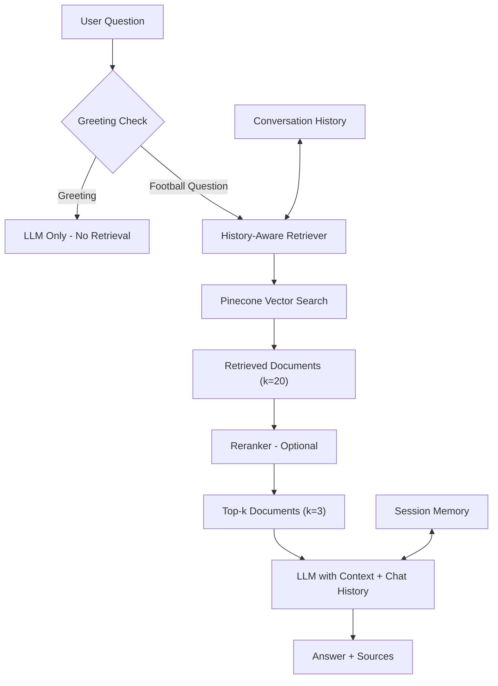

# Debra – Football Analytics RAG

An AI-powered football analytics mentor that explains football data concepts, terminology, and tactics through a retrieval-augmented chat interface.

**Live Demo:** [askdebra.onrender.com](https://askdebra.onrender.com/)

---

## Overview

Debra bridges the gap between technical data skills and football domain knowledge, delivering clear, educational explanations of football analytics concepts such as Expected Goals (`xG`), Expected Assists (`xA`), pressing metrics, and possession value, tailored to the user's experience level.

---

## Key Features

| Feature | Description |
|---|---|
| RAG-based Retrieval | Retrieves relevant knowledge from a curated corpus in a Pinecone vector database. |
| Conversational Memory | Maintains session context to support follow-up questions. |
| History-Aware Retrieval | Rephrases queries using prior conversation history for better retrieval. |
| Optional Reranking | Applies cross-encoder reranking to refine results; can be disabled. |
| Source Attribution | Displays deduplicated sources with page numbers and metadata. |
| Educational/Adaptive Responses | Adjusts explanation depth to the user's experience level. |
| Greeting and Small-Talk Detection | Bypasses retrieval for casual interactions to save tokens. |

---

## Architecture

Debra follows a retrieval-augmented generation pipeline: incoming questions are checked for greetings, then reformulated using chat history, retrieved from Pinecone, optionally reranked, and passed to the LLM along with conversation history to produce a sourced answer.

---

## Tech Stack

| Component | Technology |
|---|---|
| Backend | Flask |
| Orchestration | LangChain |
| Vector Database | Pinecone |
| Language Model | Groq |
| Runtime | Python 3.10+ |
| Deployment | Render |

---

## Deployment

Debra is deployed on Render.

**Live Demo:** [askdebra.onrender.com](https://askdebra.onrender.com/)

---

## Author

**Oseko Ashpe**
GitHub: [github.com/ashpe-osk](https://github.com/ashpe-osk)
LinkedIn: [linkedin.com/in/ashpe-ayubu](http://linkedin.com/in/ashpe-ayubu)
